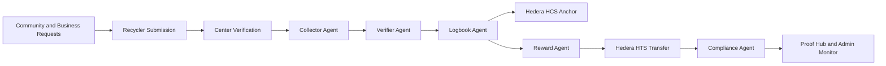

# VeriCycle

**Financial and Verification Infrastructure for the Informal Recycling Economy**

VeriCycle turns recycling into verifiable income.

It replaces risky cash-based reward flows with EcoCoin, creates immutable Proof of Income for informal recyclers, and gives businesses and municipalities auditable sustainability records.

[](https://hedera.com) [](https://python.org) [](https://flask.palletsprojects.com)

Live Demo URL: https://vericycle-ds85.onrender.com

Demo Video: https://youtu.be/OK8ozBTMZew?si=fj14lCACsipX6Wag

GitHub Repository: https://github.com/commit-to-Noma/VeriCycle

LinkedIn: https://www.linkedin.com/in/nomathemba-ncube/

---

## Table of Contents

- [Overview](#overview)
- [What This Is (In 60 Seconds)](#what-this-is-in-60-seconds)
- [The Problem](#the-problem)
- [The Solution](#the-solution)
- [Why Blockchain](#why-blockchain-why-not-web2-alone)
- [Why Hedera](#why-hedera)
- [Who Benefits](#who-benefits)
- [Key Features](#product-mvp)
- [Demo Flow (End-to-End)](#demo-flow-end-to-end)
- [What to Look For](#what-to-look-for)
- [Technology Stack](#tech-stack)
- [Quick Start](#setup)
- [Deployment](#deployment)
- [Roadmap](#roadmap)
- [Vision](#vision)
- [Architecture](#architecture)

---

## Overview

**VeriCycle upgrades survival work into a trusted, portable, and economically visible asset.**

VeriCycle enables:

- **Proof of Income** for informal recyclers
- **Verified sustainability records** for businesses
- **Auditable recycling evidence** for communities and municipalities

## What This Is (In 60 Seconds)

VeriCycle is a multi-stakeholder verification system for recycling.

It connects:
- Recyclers (who collect materials)
- Businesses (who request pickups)
- Communities (who report issues)
- Centers (who verify deposits)

Each recycling event becomes:
-> Verified by a center  
-> Processed by autonomous agents  
-> Anchored on Hedera (HCS)  
-> Rewarded via EcoCoin (HTS)  
-> Stored as Proof of Income and ESG data

The result:
A trust layer for real-world recycling.

---

## The Problem

Recycling already happens at scale, but it lacks trust, visibility, and verification.

For informal recyclers, the problem is not effort. It is invisibility. Their work creates real environmental and economic value, but without Proof of Income or trusted records, that value cannot enter formal systems.

### Global Context
- **15+ million people** globally rely on informal waste picking for survival (World Bank)
- **In South Africa**, ~90,000 waste pickers recover 80–90% of recyclables (CSIR, WWF, SERI)
- **By 2050**, global waste projected to reach **3.4 billion tonnes annually** (World Bank)

### The Gap

Despite massive real-world recycling activity, informal recyclers face:
- ❌ No proof of income
- ❌ No verifiable work history
- ❌ No trusted recycling record

**For Businesses:**
- Cannot prove what was recycled
- Cannot verify who collected it
- Cannot track where it went

**For Communities:**
- Waste complaints handled through informal channels (WhatsApp, etc.)
- No tracking or accountability
- No visibility into outcomes

**👉 The problem is not collection. The problem is trust and verification.**

---

## The Solution

VeriCycle creates a verification network for recycling that connects:

- **Recyclers** — collect and submit materials
- **Businesses** — request pickups and track sustainability
- **Communities** — report issues and request service
- **Recycling Centers** — verify deposits and validate submissions
- **Autonomous Agents** — process and finalize verification

### Each recycling event becomes:

✅ **A verified record** — immutable, timestamped event log  
✅ **A Hedera-anchored transaction** — on-chain proof  
✅ **A Proof of Income entry** — supports financial inclusion  
✅ **A sustainability proof** — enables ESG reporting  
✅ **A reward-triggering event** — earns EcoCoin  

### Solution Summary

VeriCycle converts recycling labor into a portable economic record: verifiable work history, immutable Proof of Income, and auditable sustainability evidence that can be trusted across institutions.

### Flexibility by Design

Recyclers can:
- Accept pickup requests from businesses, OR
- Independently collect and submit materials

This ensures the system reflects real-world behavior, not just structured workflows.

VeriCycle does not digitize recycling. It makes it economically visible.

---

## Why Blockchain? Why Not Web2 Alone?

Recycling involves **multiple independent stakeholders**.

Without a shared ledger:
- Each party maintains its own version of truth
- Records are not trusted across entities
- Disputes cannot be resolved transparently

### VeriCycle's Hybrid Approach

| Layer | Purpose |
|-------|---------|
| **Web2** (Flask, SQLAlchemy) | Runs the application, stores operational data |
| **Hedera** (HCS + HTS) | Secures the truth, provides immutable event logs, enables cross-party verification |

👉 **VeriCycle uses Web2 for usability and Hedera for trust.**

---

## Why Hedera

VeriCycle leverages:

- **Hedera Consensus Service (HCS)** → Immutable recycling event logs
- **Hedera Token Service (HTS)** → EcoCoin reward system

### Why Hedera is the Perfect Fit

Hedera is the shared trust layer that allows independent stakeholders - recyclers, centers, businesses, and municipalities - to rely on the same verified record without trusting each other directly.

✅ **Low transaction costs** — supports high-frequency real-world events  
✅ **Fast finality** — near real-time verification  
✅ **Energy efficiency** — aligned with sustainability mission  

### Energy Comparison

Hedera consumes **~0.000003 kWh per transaction**:

| Blockchain | Cost per Tx |
|-----------|------------|
| **Hedera** | 0.000003 kWh |
| Bitcoin | 885 kWh |
| Ethereum | 102 kWh |

👉 **Hedera is orders of magnitude more energy efficient than traditional blockchains like Bitcoin.**

### Value for Hedera

VeriCycle drives:
- Real-world transaction volume through high-frequency events
- New Hedera accounts (recyclers, businesses, centers)
- Increased TPS through micro-transactions
- A **sustainability-aligned, non-speculative use case**

👉 **This positions Hedera as infrastructure for real economic activity, not just financial speculation.**

---

## Who Benefits

### 🔄 Recyclers (Primary Impact)
- **Earn EcoCoin** → Predictable income signal
- **Build Proof of Income** → Financial inclusion potential  
- **Reduce exploitation** → Verified, immutable records

### 🏢 Businesses
- **Verified recycling records** → Credible ESG reporting  
- **Traceability** → Compliance and audit readiness  
- **Proof** → Reduces greenwashing risk

### 👥 Communities
- **Structured reporting** → Replaces WhatsApp-based systems  
- **Visibility** → Track what gets resolved  
- **Accountability** → Transparent process

### 🏭 Recycling Centers / Municipalities
- **Verification authority** → Trusted system role  
- **Data insights** → Planning and accountability  
- **Verifiable records** → Compliance documentation

### 💼 Market Opportunity

- **10,000+ companies** report sustainability data through GRI
- **$30+ trillion** in global assets under ESG management
- Companies using sustainability strategies: **48% profit increases** (McKinsey)

👉 **Verified sustainability data is no longer optional — it is economically valuable.**

---

## EcoCoin (Incentive Model)

EcoCoin is a reward token issued for verified recycling activity.

## 🪙 Tokenomics: The EcoCoin (ECO) Advantage

VeriCycle incentivizes informal recyclers by offering an Eco-Premium over traditional scrapyard cash rates.
Because the platform captures immutable ESG data on Hedera, enterprise businesses pay for verified impact certificates.
This secondary revenue stream subsidizes EcoCoin payouts and allows recyclers to earn around 20%-40% more value for key materials.

Baseline valuation target in demo economics: **1 ECO ≈ R1.00 (ZAR) purchasing power**.

| Material | Scrapyard Cash (Est. per kg) | VeriCycle Reward (ECO per kg) | Eco-Premium |
| --- | --- | --- | --- |
| Glass | R 0.50 - R 0.80 | 1.2 ECO | + 50% more value |
| Paper & Cardboard | R 1.50 - R 2.00 | 2.8 ECO | + 40% more value |
| Plastics (PET) | R 3.00 - R 4.00 | 5.0 ECO | + 25% more value |
| Metals (Cans) | R 10.00 - R 14.00 | 16.0 ECO | + 15% more value |
| E-Waste | R 20.00 - R 25.00 | 35.0 ECO | + 40% more value |

Judge pitch for sustainability of payouts:

> In the traditional system, middlemen take a large cut. VeriCycle removes that cut with direct digital rails and verifies every event using Hedera-backed proof. We monetize cryptographically verified ESG data for enterprise reporting, then pass that premium back to recyclers as higher EcoCoin payouts.

It represents:
- **Verified contribution** — proven participation in recycling
- **Measurable environmental impact** — backed by on-ground verification
- **Future financial value** — accessible through partner networks

### Value Sources

- Business sustainability budgets
- Municipalities and local governments
- NGOs and environmental organizations
- Sponsored environmental campaigns
- Future verification and reporting services

**Key insight:** EcoCoin links financial incentives directly to verified environmental impact.

---

## Product (MVP)

A fully functional, end-to-end system demonstrating real-world recycling verification across all stakeholders.

### Role-Based Dashboards
- **Recycler** → Accept/submit opportunities
- **Business** → Create requests, track verification
- **Community** → Report issues, request pickups
- **Center** → Verify deposits, confirm materials
- **Admin** → Monitor pipeline, audit entire system

### Core Features ✅
- Pickup request system
- Recycler submission flow
- Center verification system
- Hedera integration (HCS + HTS)
- Proof generation system
- EcoCoin reward system
- Agent-based verification pipeline
- Admin monitoring and audit tools
- QR-assisted workflows

## Demo Flow (End-to-End)

1. Log in as **Business**  
	-> Create a pickup request
2. Log in as **Recycler**  
	-> Accept request and submit materials
3. Log in as **Center**  
	-> Verify deposit (weight + material)
4. System automatically:  
	-> Anchors event on Hedera (HCS)  
	-> Issues EcoCoin reward (HTS)
5. View results:  
	-> Recycler sees Proof of Income  
	-> Business sees verified ESG record
6. Admin Monitor:  
	-> Observe full pipeline and verification trace

## What to Look For

When reviewing VeriCycle, focus on:

- End-to-end verification across multiple stakeholders
- Hedera integration (HCS + HTS)
- Proof generation and auditability
- Real-world usability (not just blockchain mechanics)
- Economic impact: Proof of Income + ESG data

The system is designed to demonstrate trust, transparency, and verifiability in real-world coordination.

---

## Why People Will Use It

| Current System | VeriCycle |
|---------------|-----------|
| Cash payments | Digital records |
| No proof | Verified income |
| No history | Trackable activity |
| Informal | Formal, auditable |
| No visibility | Complete transparency |

### Key UX Insight
**Users do not need blockchain knowledge. Blockchain is invisible. Value is obvious.**

---

## Tech Stack

**Built for real-world deployment, not experimentation.**

### Backend
- **Flask** — web application framework
- **SQLAlchemy** — database ORM
- **Flask-Login & Flask-Bcrypt** — authentication & security
- Worker-based agent pipeline

### Blockchain
- **Hedera Consensus Service (HCS)** — event anchoring
- **Hedera Token Service (HTS)** — EcoCoin tokens
- **Hedera SDK** — JavaScript + Python integration

### Frontend
- HTML / CSS / JavaScript
- Role-based template system
- QR-assisted workflows
- Responsive design

### Infrastructure
- **Docker** — containerization
- **Gunicorn** — application server
- **SQLite** (development) / **PostgreSQL** (production)

---

## Setup

### Prerequisites
```
Python 3.11+
Node.js 18+
pip and npm
Git
```

### Quick Start

**1. Install Dependencies**
```bash
pip install -r requirements.txt
npm install
```

**2. Initialize Database**
```bash
python scripts/reset_db.py
```

**3. Configure Environment**

Copy `.env.example` to `.env` and fill in:
```
SECRET_KEY=your_secret_key
FLASK_ENV=development
FLASK_DEBUG=1
DATABASE_URL=
NETWORK=testnet
HEDERA_ACCOUNT_ID=0.0.xxxxx
HEDERA_PRIVATE_KEY=302e...
VERICYCLE_TOPIC_ID=your_topic_id
OPERATOR_ID=your_operator_id
OPERATOR_KEY=your_operator_key
ECOCOIN_TOKEN_ID=your_token_id
ECOCOIN_TREASURY_ID=your_treasury_id
ECOCOIN_TREASURY_KEY=your_treasury_key
DEMO_MODE=true
ENCRYPTION_KEY=your_encryption_key
```

**4. Run Application** (Terminal 1)
```bash
python app.py
```
App available at `http://127.0.0.1:5000`

**5. Run Agent Worker** (Terminal 2 - recommended)
```bash
python -m agents.task_worker
```

**6. Run Smoke Tests**
```bash
pytest -q
```

### Demo Accounts

When `DEMO_MODE=1`, these demo accounts are automatically seeded on app startup (including Render redeploys).

| Email | Password | Role |
|-------|----------|------|
| `admin@vericycle.com` | `Admin123!` | Administrator |
| `recycler@vericycle.com` | `Recycler123!` | Recycler |
| `business@vericycle.com` | `Business123!` | Business |
| `resident@vericycle.com` | `Resident123!` | Resident |
| `center@vericycle.com` | `Center123!` | Recycling Center |

### Useful Commands

**Prepare deterministic demo events:**
```bash
python scripts/prepare_phase5_demo_events.py
```

**Run validation tests:**
```bash
python scripts/test_pages_smoke.py
python scripts/test_phase3_opportunities_smoke.py
python scripts/test_phase6_business_and_labels.py
python scripts/test_review_transitions.py
python scripts/run_single_account_demo_check.py
```

## Deployment

### Run in Production (Example)
```bash
gunicorn app:app --workers 3 --timeout 120 --bind 0.0.0.0:$PORT
```

### Recommended Platforms
- Railway
- Render
- Fly.io
- AWS / GCP (advanced)

### Production Checklist
- [ ] Set `FLASK_ENV=production`
- [ ] Configure secure SECRET_KEY and ENCRYPTION_KEY
- [ ] Set `DATABASE_URL` and `NETWORK`
- [ ] Set `HEDERA_ACCOUNT_ID` and `HEDERA_PRIVATE_KEY` (or OPERATOR aliases)
- [ ] For hackathon visual/data parity with local demo, set `DEMO_MODE=1`
- [ ] Use environment-managed Hedera credentials
- [ ] Deploy with managed database (PostgreSQL)
- [ ] Enable secret storage policies
- [ ] Configure reverse proxy (nginx)
- [ ] Set up monitoring and alerting
- [ ] Enable HTTPS

---

## Roadmap

### Phase 1 (Now) ✅
- MVP completion ✅
- UI/UX refinement
- Proof system optimization

### Phase 2
- Partner onboarding (centers + businesses)
- Pilot programs
- Reward pool integration

### Phase 3
- Municipality integration
- Analytics dashboards
- Ecosystem scaling

### Phase 4
- Financial inclusion integrations
- Token utility expansion
- Global expansion

---

## Vision

**A circular economy only works when contribution can be proven.**

VeriCycle makes recycling:

- **Visible** — tracked from collection to verification
- **Trusted** — backed by Hedera consensus  
- **Economically meaningful** — generates Proof of Income and ESG value

Every recycling event deserves to be recorded, verified, and valued.

## Architecture

VeriCycle runs a hybrid architecture:

| Layer | Responsibility |
|-------|----------------|
| Application Layer | Flask app, role-based workflows, proof generation |
| Coordination Layer | Agent pipeline: Collector -> Verifier -> Logbook -> Reward -> Compliance |
| Trust Layer | Hedera HCS for immutable event logs, HTS for EcoCoin reward rails |
| Evidence Layer | Proof bundles, business sustainability records, recycler Proof of Income history |

This separation keeps user experience simple while preserving cross-party trust and auditability.

### Architecture Diagram


---

## Supporting Materials

- **Demo Script:** [Phase 5 Judge Demo](docs/phase5_judge_demo_script.md)
- **Architecture:** See [Architecture Snapshot](README.md#architecture) section
- **Agent Pipeline:** CollectorAgent → VerifierAgent → LogbookAgent → RewardAgent → ComplianceAgent

---

## Support & Contributing

For questions, issues, or contributions, please reach out to the VeriCycle team.

VeriCycle is built for the informal economy while embracing formal verification infrastructure. Your feedback shapes our roadmap.

---

*VeriCycle: Making recycling visible, trusted, and economically meaningful.*

**Built for real-world impact. Powered by Hedera. Verified forever.**
